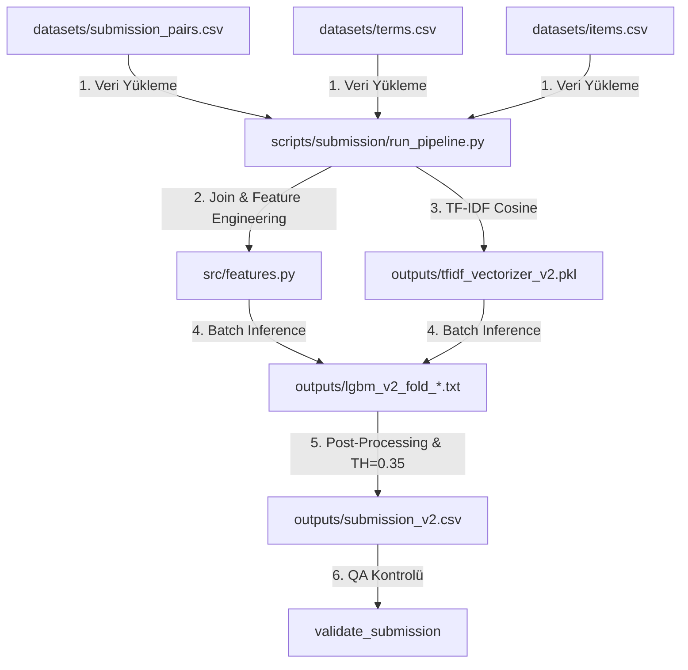

# Pipeline Çalıştırma Rehberi — Runbook v1 (14 Temmuz)

**Hazırlayan:** Muhammed Köseoğlu  
**Tarih:** 14 Temmuz 2026  
**Sürüm:** v1.0.0  
**Kapsam:** Tek Komutla Feature Üretim ve Prediction Akışı

---

## 1. Genel Mimari ve Akış Diyagramı

Runbook v1, ham veriden nihai teslim dosyasına (`submission.csv`) giden tüm süreci otomatikleştirir ve standartlaştırır.



---

## 2. İlk Çalıştırma ve Hızlı Test Adımları

Yarışma gününde akışın doğruluğunu test etmek için **10.000 satırlık hızlı örneklem modu** kullanılır:

```bash
# 1. Proje kök dizinine gidin
cd G.G.A

# 2. Hızlı test modunda pipeline'ı çalıştırın
python scripts/submission/run_pipeline.py --mode predict --sample 10000 --batch-size 5000
```

---

## 3. Üretim (Production) Çalıştırma Adımları

Tam 3.36 milyon satırlık test seti üzerinde tahmini başlatmak için:

```bash
# Bellek durumunuza göre batch-size belirleyerek (varsayılan: 100.000) çalıştırın
python scripts/submission/run_pipeline.py --mode predict
```

---

## 4. Günlük (Log) Dosyası Yapısı

Pipeline, çalıştırıldığı anda `outputs/pipeline.log` dosyasına ve ekrana eşzamanlı olarak detaylı adımları yazar:

```
2026-07-14 08:00:00,123 [INFO] G.G.A Uçtan Uca Prediction Pipeline Başlatıldı.
2026-07-14 08:00:00,125 [INFO] Dosya bağımlılıkları kontrol ediliyor...
2026-07-14 08:00:00,130 [INFO] Tüm model bağımlılıkları doğrulandı.
2026-07-14 08:00:00,135 [INFO] Adım 1/5: Ham veri setleri yükleniyor (terms.csv, items.csv)...
2026-07-14 08:00:05,450 [INFO] Adım 2/5: Arama çiftleri yükleniyor: datasets/submission_pairs.csv
2026-07-14 08:00:08,120 [INFO] Adım 3/5: Modeller ve TF-IDF Vectorizer yükleniyor...
2026-07-14 08:00:10,340 [INFO] Adım 4/5: Batch'ler halinde özellik üretimi ve inference başlıyor...
2026-07-14 08:00:30,150 [INFO]   İşlenen: 100,000 / 3,359,679 (3.0%) | Hız: 5000 satır/sn
2026-07-14 08:00:50,220 [INFO]   İşlenen: 200,000 / 3,359,679 (6.0%) | Hız: 5000 satır/sn
...
2026-07-14 08:11:15,880 [INFO] Adım 5/5: Karar eşiği uygulanıyor ve çıktı dosyası oluşturuluyor...
2026-07-14 08:11:18,920 [INFO] Sonuçlar kaydediliyor: outputs/submission_v2.csv
2026-07-14 08:11:19,100 [INFO] Submission dosyası format doğrulaması yapılıyor...
2026-07-14 08:11:19,250 [INFO] Pipeline başarıyla tamamlandı! Toplam süre: 679.1 saniye.
```

---

## 5. Doğrulama ve Güvenlik Adımları

Pipeline başarıyla bittikten sonra aşağıdaki QA kontrollerini otomatik çalıştırır:
1. Satır sayısının `3.359.679` olup olmadığını kontrol eder.
2. Kolon isimlerinin `id` ve `label` olduğunu doğrular.
3. Eksik (null) veya NaN değer olmadığını teyit eder.
4. Sınıflandırma tahminlerinin sadece `0` veya `1` olduğunu kontrol eder.

*Bu belge yarışma günündeki MLOps yönergemizdir.*
